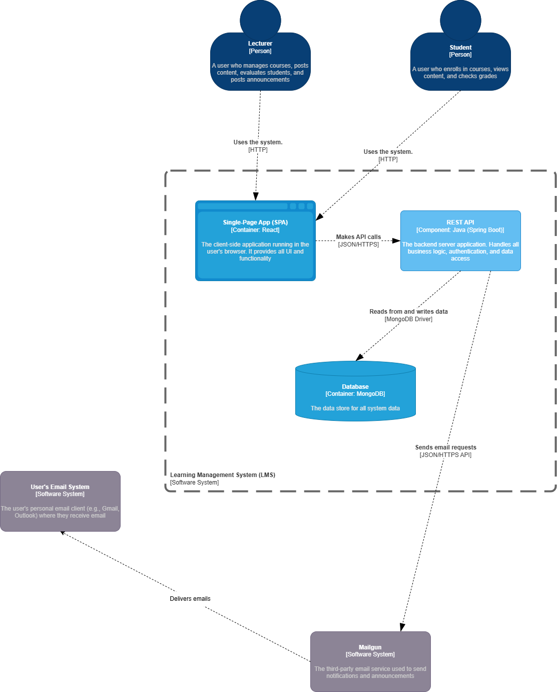

# Learning Management System (LMS) - Backend

## Overview

This repository contains the backend code for a comprehensive Learning Management System designed for university environments. The system facilitates interaction between students and teachers, streamlining the academic process from course enrollment to grading and communication.

## Features

### 👥 User Management
- **Registration:** Secure sign-up process for both Students and Teachers.
- **Authentication:** Role-based login system (Student/Teacher) with secure password handling.
- **Profiles:** Persistent user profiles for personalized dashboards.

### 📚 Course Management
- **Course Catalog:** Students can browse available university courses with details (description, instructor, schedule).
- **Enrollment:** One-click enrollment for students.
- **Class Rosters:** Teachers can view lists of all courses they teach and the students enrolled in them.

### 📝 Grading & Assessment
- **Teacher Tools:** Interface for teachers to input marks for assignments, tests, and modules.
- **Student Portal:** Dedicated grades page for students to track their academic performance across all courses.

### 📢 Communication & Resources
- **Announcements:** Teachers can post updates which trigger automatic email notifications to enrolled students.
- **Study Materials:** Centralized repository for teachers to upload lecture notes, assignments, and reading resources.

## Architecture

### C4 Level 2 Container Diagram


## Tech Stack

- **Language:** Java 21
- **Framework:** Spring Boot 3.5
- **Build Tool:** Maven
- **Database:** (Configured in `application.properties`)

## Getting Started

### Prerequisites
- Java Development Kit (JDK) 21 or higher
- Maven

### Installation

1. **Clone the repository**
   ```bash
   git clone https://github.com/theekshana-nirmal/lms-backend.git
   cd lms-backend
   ```

2. **Build the project**
   ```bash
   ./mvnw clean install
   ```

3. **Run the application**
   ```bash
   ./mvnw spring-boot:run
   ```

The application will start on the default port (usually 8080).

## Project Structure

```
src/main/java/lk/uwu/lms_backend/
├── config/          # Configuration classes
├── controllers/     # REST API Controllers
├── dtos/            # Data Transfer Objects
├── models/          # JPA Entities
├── repositories/    # Database access interfaces
├── security/        # Authentication & Authorization logic
└── services/        # Business logic layer
```